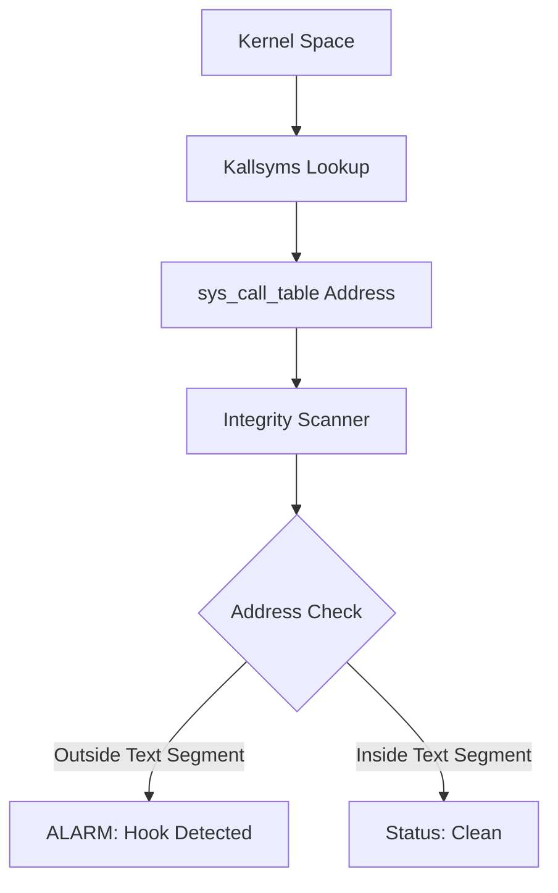

# Stealth Rootkit Detector

Advanced Linux Kernel Module (LKM) for identifying malicious hooks in the system call table.

## 🏗️ Architecture


## 🔬 Detection Theory
This detector operates on the principle of **Memory Forensics**. In a clean Linux environment, the addresses stored in the `sys_call_table` point to the kernel's text segment. Rootkits typically hijack these by:
1. Modifying the table to point to their own malicious code.
2. Splicing/Proxying the original function.

Our tool performs a boundary check against `_text` and `_etext` symbols to identify jumps into non-standard memory regions.

## 🚀 Usage
```bash
make
sudo insmod detector.ko
dmesg | tail
```